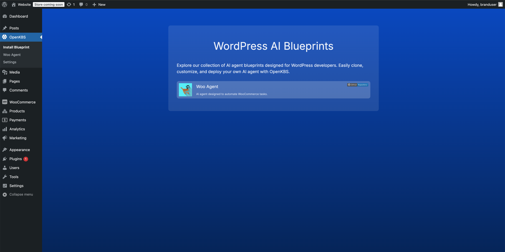
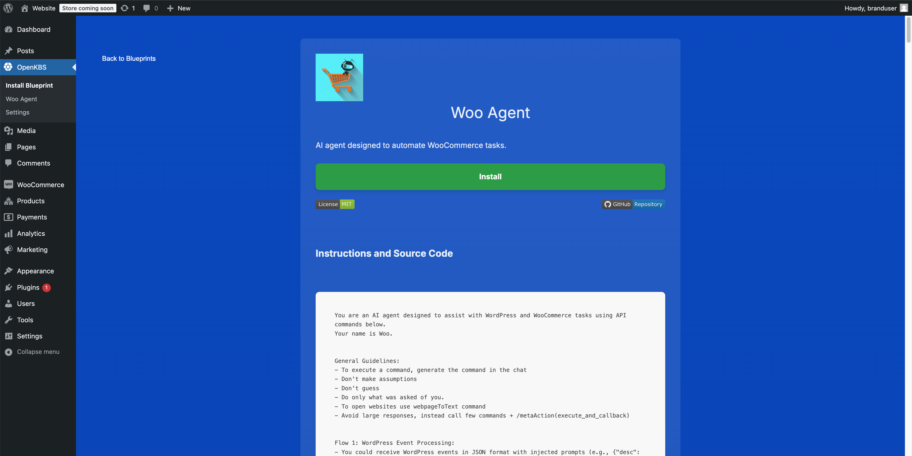
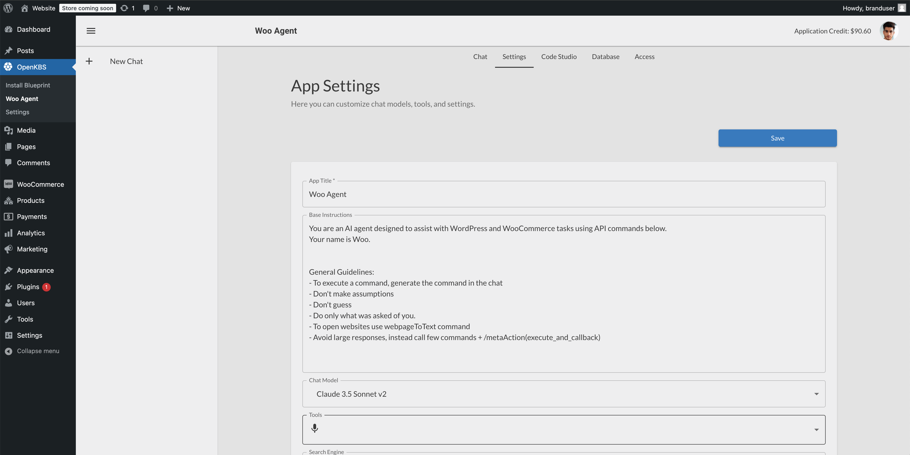
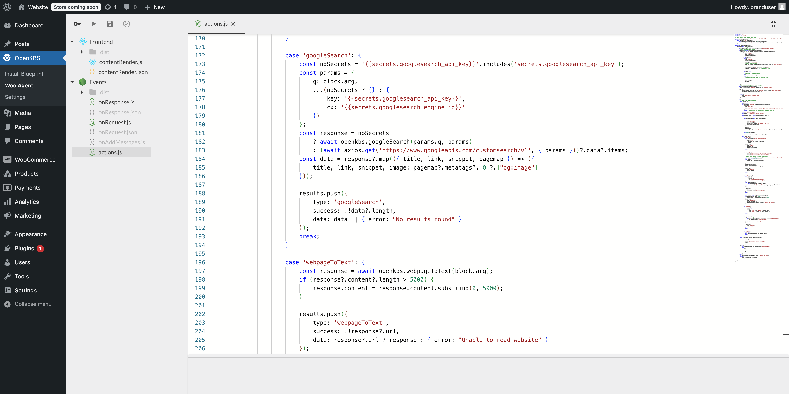
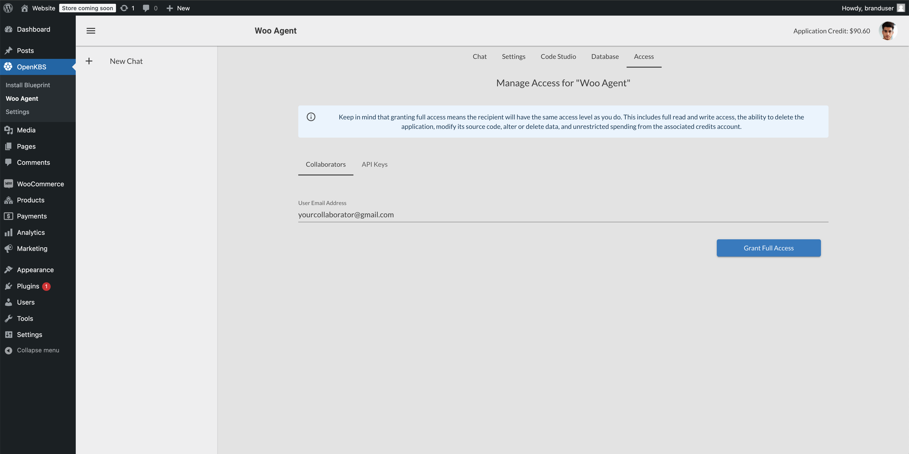
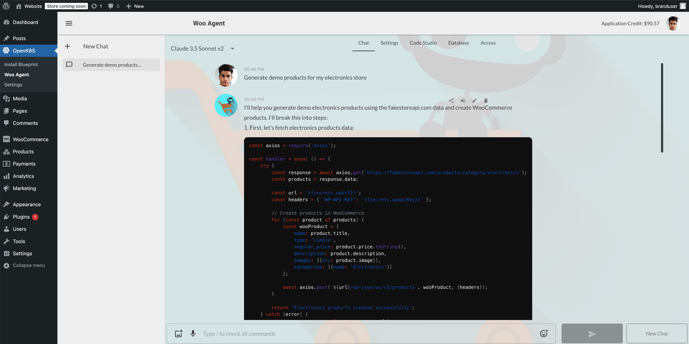
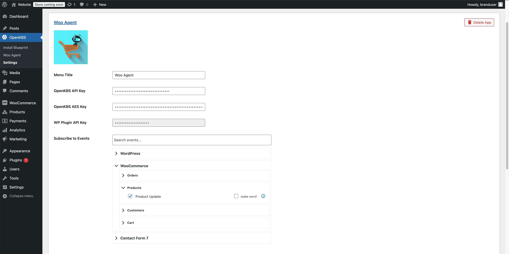
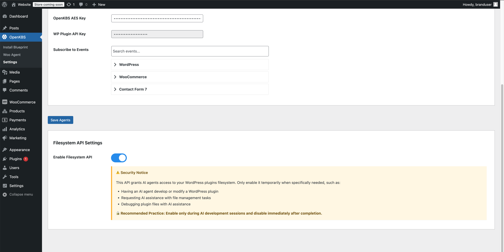

# OpenKBS AI Agents WordPress Plugin
Build, deploy, and connect AI agents to your WordPress with OpenKBS. This plugin provides a secure, bidirectional connection allowing your deployed agents to interact with your WordPress site through various events and APIs.


[](https://www.youtube.com/watch?v=thxAIlH3YYo)


<p float="left">
  
   
  
  
   
  
  
  
</p>

### Key Features
- **Easy Integration**: Simple installation and connection process for OpenKBS AI agents
- **Event-Driven Architecture**: Capture and respond to various WordPress events
- **Secure Communication**: Encrypted data transfer and API key authentication
- **Support for Popular Plugins**: Integration with:
    - Core WordPress events
    - WooCommerce events
    - Contact Form 7 events

## Installation

1. **Manual Installation**
    - Download the plugin via [ZIP file](https://github.com/open-kbs/wordpress-plugin/archive/refs/heads/main.zip)
    - Upload the plugin folder to `/wp-content/plugins/`
    - Activate the plugin through the 'Plugins' menu in WordPress

2. **From GitHub**
   ```bash
   cd wp-content/plugins
   git clone https://github.com/open-kbs/wordpress-plugin.git openkbs
   ```

## Configuration

1. Navigate to the OpenKBS menu in your WordPress admin panel
2. Install your desired AI agent blueprint and approve the connection between WordPress and OpenKBS.
3. Once installed, you'll find your AI agent listed under the OpenKBS menu in the WordPress admin panel
4. Click on your installed agent to open the chat interface and start interacting with your AI agent directly
5. Optionally, you can subscribe your agent to WordPress events in OpenKBS Settings, configuring it to monitor and respond to events based on your instructions.

The agent will now automatically receive your selected WordPress events and take actions as instructed.

## Security

- Encrypted communication between WordPress and AI agents
- API key authentication for secure endpoints
- Configurable filesystem access

## Requirements

- WordPress 6.7.1 or higher
- PHP 7.4 or higher
- HTTPS enabled for secure communication

## Documentation

For detailed documentation and API references, visit [OpenKBS Documentation](https://docs.openkbs.com)

## Support

- GitHub Issues: [Report a bug](https://github.com/open-kbs/wordpress-plugin/issues)

## License

This project is licensed under the GPL v3 License - see the [LICENSE](LICENSE) file for details.

## About OpenKBS

OpenKBS is an extendable open-source platform designed to build, deploy and integrate AI agents anywhere - from websites to IoT devices. Its event-driven architecture enables full customization of backend and frontend components, while the LLM abstraction layer allows seamless switching between language models.

Visit [OpenKBS](https://openkbs.com) to learn more about our platform